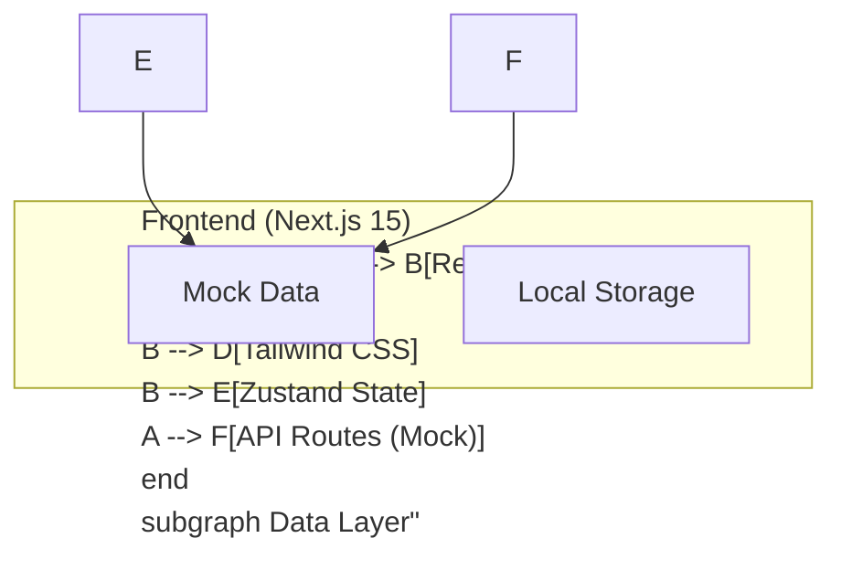
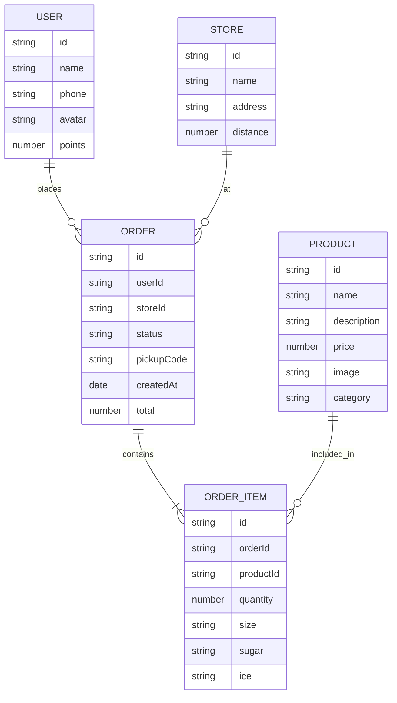

## 1. Architecture Design



## 2. Technology Description
- **前端: Next.js 15 + React 19 + TypeScript
- **样式**: Tailwind CSS 3
- **UI组件**: shadcn/ui
- **状态管理**: Zustand
- **图标**: Lucide React
- **构建工具**: Next.js Built-in
- **部署**: Vercel

## 3. Route Definitions
| Route | Purpose |
|-------|---------|
| / | 首页 - 商品浏览、门店选择 |
| /login | 登录页 - 用户登录 |
| /orders | 订单页 - 订单查看 |
| /cart | 购物车 - 商品管理 |
| /payment | 支付页 - 订单支付 |
| /profile | 个人中心 - 用户信息 |

## 4. Data Model

### 4.1 Data Model Definition



### 4.2 Type Definitions

```typescript
// User type
interface User {
  id: string;
  name: string;
  phone: string;
  avatar: string;
  points: number;
}

// Store type
interface Store {
  id: string;
  name: string;
  address: string;
  distance: number;
}

// Product type
interface Product {
  id: string;
  name: string;
  description: string;
  price: number;
  image: string;
  category: string;
}

// Cart Item type
interface CartItem {
  id: string;
  product: Product;
  quantity: number;
  size: 'small' | 'medium' | 'large';
  sugar: 'none' | 'less' | 'normal' | 'more';
  ice: 'none' | 'less' | 'normal' | 'more';
}

// Order type
interface Order {
  id: string;
  userId: string;
  storeId: string;
  status: 'pending' | 'preparing' | 'ready' | 'completed';
  pickupCode: string;
  createdAt: Date;
  total: number;
  items: CartItem[];
}
```

## 5. Project Structure

```
/workspace
├── app/
│   ├── layout.tsx          # Root layout
│   ├── page.tsx            # Home page
│   ├── login/
│   │   └── page.tsx       # Login page
│   ├── orders/
│   │   └── page.tsx       # Orders page
│   ├── cart/
│   │   └── page.tsx       # Cart page
│   ├── payment/
│   │   └── page.tsx       # Payment page
│   └── profile/
│       └── page.tsx       # Profile page
├── components/
│   ├── ui/                 # shadcn/ui components
│   ├── layout/             # Layout components
│   └── features/           # Feature components
├── lib/
│   ├── store.ts             # Zustand store
│   ├── mock.ts              # Mock data
│   └── utils.ts             # Utility functions
├── public/
│   └── images/
├── package.json
├── tailwind.config.ts
└── tsconfig.json
└── next.config.ts
```

## 6. State Management (Zustand)

```typescript
interface AppState {
  user: User | null;
  cart: CartItem[];
  currentStore: Store | null;
  orders: Order[];
  products: Product[];
  setUser: (user: User | null) => void;
  addToCart: (item: CartItem) => void;
  updateCartItem: (id: string, updates: Partial<CartItem>) => void;
  removeFromCart: (id: string) => void;
  clearCart: () => void;
  setCurrentStore: (store: Store) => void;
  addOrder: (order: Order) => void;
}
```
