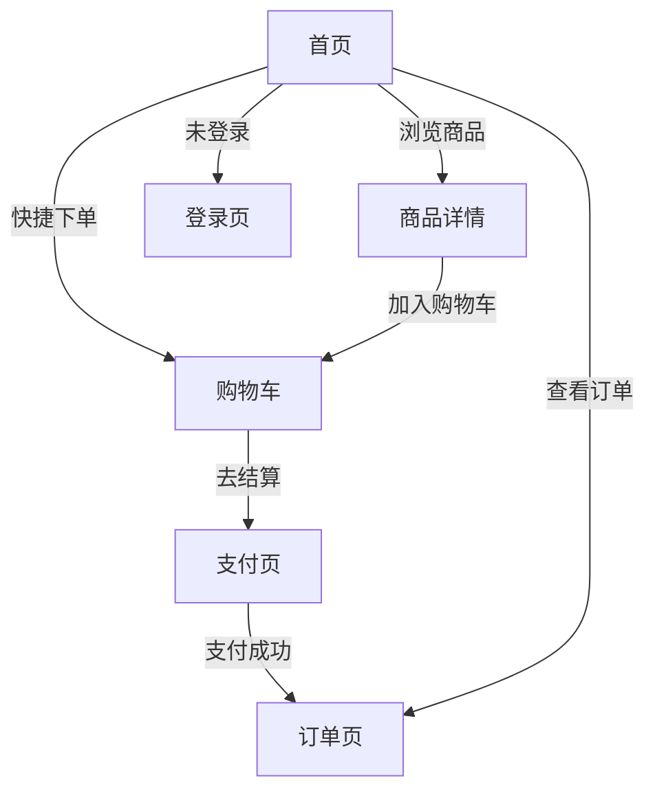

## 1. Product Overview
咖啡订购移动应用，为用户提供便捷的咖啡点单服务，支持即时下单和预约点单，实时订单状态追踪。
- 目标用户：快节奏生活的城市白领、咖啡爱好者、学生群体
- 核心价值：快速下单、便捷取餐、优质咖啡体验

## 2. Core Features

### 2.1 User Roles
| Role | Registration Method | Core Permissions |
|------|---------------------|------------------|
| 普通用户 | 手机号验证码登录 | 浏览商品、下单、查看订单、管理个人信息 |

### 2.2 Feature Module
1. **首页**: 附近门店选择、推荐商品展示、快捷下单入口
2. **登录页**: 手机号验证码登录、微信登录、游客模式
3. **订单页**: 进行中订单、历史订单、取餐码展示
4. **购物车**: 商品管理、优惠券选择、订单备注
5. **支付页**: 支付方式选择、订单详情、积分抵扣
6. **个人中心**: 用户信息、订单历史、设置

### 2.3 Page Details
| Page Name | Module Name | Feature description |
|-----------|-------------|---------------------|
| 首页 | 门店选择 | 显示最近门店，支持切换门店和预约时间 |
| 首页 | 推荐商品 | 展示今日推荐咖啡，支持添加到购物车 |
| 首页 | 快捷入口 | 提供"现在下单"和"预约点单"快捷通道 |
| 登录页 | 手机登录 | 手机号输入、验证码获取、登录按钮 |
| 登录页 | 第三方登录 | 微信登录、本机一键登录、游客模式 |
| 订单页 | 进行中订单 | 展示当前订单状态、取餐码、预计时间 |
| 订单页 | 历史订单 | 查看历史订单列表和详情 |
| 购物车 | 商品列表 | 展示已选商品，支持增减数量、删除 |
| 购物车 | 结算 | 优惠券选择、订单备注、金额计算 |
| 支付页 | 支付方式 | 微信支付、支付宝、账户余额选择 |
| 支付页 | 订单确认 | 订单详情、积分抵扣、一键支付 |

## 3. Core Process
用户打开应用 → 浏览首页推荐商品 → 选择商品加入购物车 → 进入购物车确认 → 选择支付方式 → 完成支付 → 查看订单状态 → 到店取餐

## 4. User Interface Design

### 4.1 Design Style
- **主色调**: 蓝色 (#1E88E5)、白色 (#FFFFFF)
- **辅助色**: 浅灰色 (#F5F7FA)、深灰色 (#6B7280)
- **按钮风格**: 圆角矩形、大圆角按钮、悬停效果
- **字体**: 现代无衬线字体，16px基础字体，标题18-24px
- **布局风格**: 卡片式布局、底部导航栏、移动端优先
- **图标风格**: 简洁线性图标，使用Lucide图标库

### 4.2 Page Design Overview
| Page Name | Module Name | UI Elements |
|-----------|-------------|-------------|
| 首页 | 头部区域 | 用户头像、状态栏、门店选择卡片 |
| 首页 | 快捷入口 | 两个大卡片，蓝色和浅灰色，带图标和文字 |
| 首页 | 商品列表 | 横向滚动卡片，展示商品图片、名称、价格、添加按钮 |
| 登录页 | Logo区域 | 品牌Logo、标语 |
| 登录页 | 表单区域 | 手机号输入框、验证码输入框、获取验证码按钮 |
| 订单页 | Tab切换 | 进行中/历史订单Tab |
| 订单页 | 订单卡片 | 取餐码、二维码、预计时间、门店信息 |
| 购物车 | 商品项 | 商品图片、名称、规格、数量控制、价格 |
| 支付页 | 支付选项 | 单选按钮、支付方式图标、说明文字 |

### 4.3 Responsiveness
- 移动端优先设计，支持320px-480px屏幕宽度
- 自适应布局，卡片间距随屏幕调整
- 触摸优化，按钮最小44x44px点击区域
- 底部导航栏固定，适配安全区域

### 4.4 动画效果
- 页面切换淡入淡出动画
- 卡片悬停上浮效果
- 商品添加购物车成功动画
- 加载状态骨架屏
- 按钮点击反馈
